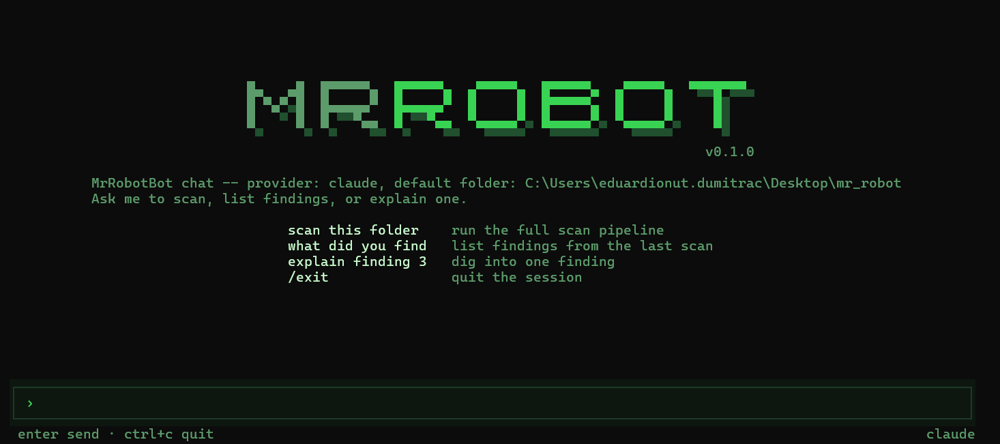

# MrRobot

A local security auditor for your own codebases. It runs the usual static tools (Semgrep, Gitleaks, npm audit), then puts an LLM over the top to review the same code and sift the results, and gives you three ways to work with what comes back: a chat agent in your terminal, a headless scan for scripts and CI, and a desktop app.

Nothing is uploaded anywhere except the file contents sent to whichever AI provider you pick, and only during the AI pass. The static tools make no network calls at all. Pick the `mock` provider or a local Ollama model and the whole scan stays on your machine.

It reports problems and explains them. It does not write fixes.

## What it actually does

A scan runs in stages:

1. **Static pass.** Semgrep against the OWASP Top Ten, security-audit and secrets rule packs. Optionally Gitleaks for committed credentials and npm audit for dependency CVEs.
2. **Recon.** One LLM call that maps the codebase and decides which files deserve close attention.
3. **Scanner.** The AI reviews files in batches, looking for the logic-level problems pattern matchers miss. There is an opt-in mode that splits this into four specialists running in parallel: authorization, injection, secrets and crypto, then data exposure and business logic.
4. **Verifier.** A second, adversarial LLM pass over the scanner's candidates that confirms, rejects, or downgrades each one before it reaches you.
5. **Merge.** Static and AI findings covering the same line get folded together and marked as confirmed by both.

Findings you decide are not real can be suppressed into `.mrrobotbot-baseline.json`, which is meant to be committed and shared with your team. Every scan is recorded, so the next one can show you what changed.

Providers: Claude, Groq, DeepSeek, Gemini, OpenAI, local Ollama, plus a `mock` provider that returns canned findings so you can exercise the whole pipeline without spending anything.

## Install

You need [Node.js](https://nodejs.org) 18 or newer.

```bash
git clone https://github.com/edysojog/mr-robot.git
cd mr-robot
npm install
npm link
```

`npm link` is what puts the `mrrobot` command on your PATH. Without it you can still run everything through `npm run`, but every example below assumes you ran it.

Check it worked:

```bash
mrrobot
```

You should get the command list.

### Tools it calls out to

Semgrep is the only one you need for a normal scan, and even that is skippable with `--no-semgrep`.

| Tool | Needed for | Install |
| --- | --- | --- |
| Semgrep | the static pass | `pip install semgrep` |
| Gitleaks | `--gitleaks` secret scanning | [github.com/gitleaks/gitleaks](https://github.com/gitleaks/gitleaks) |
| git | `--diff` and the pre-commit hook | probably already installed |
| [Bun](https://bun.sh) | the full terminal UI | optional, see below |

If Bun is missing, `mrrobot code` still works. It falls back to a simpler interface and tells you why.

### First run

Start with the free path. No API key, no cost, nothing leaves your machine:

```bash
mrrobot audit . --semgrep-only --gitleaks --deps
```

That scans the current folder and prints a report. Once you want the AI pass, set a key for whichever provider you use:

```bash
# PowerShell
$env:ANTHROPIC_API_KEY = "sk-ant-..."

# bash
export ANTHROPIC_API_KEY=sk-ant-...
```

The variables are `ANTHROPIC_API_KEY`, `GROQ_API_KEY`, `DEEPSEEK_API_KEY`, `GEMINI_API_KEY` and `OPENAI_API_KEY`. Ollama needs no key. You can also pass a key inline with `--api-key`, and `mrrobot code` will prompt you for one if it cannot find any.

Groq has a free tier, which makes it the cheapest way to try the AI pass for real.

## mrrobot code

An agent you talk to in plain English. It decides on its own when to scan, when to list what it found, and when to go read the source again to answer a question properly.



```bash
mrrobot code
mrrobot code --provider groq
mrrobot code --cwd ../some-other-project
```

It has three tools always available:

- `scan_project` runs the full pipeline on a folder
- `list_findings` lists what the last scan turned up, filterable by severity
- `explain_finding` answers a question about one finding, re-reading the actual source rather than working from the summary

A session looks like asking it to scan the project, asking what it found, then picking at whatever looks interesting. It is also just a chat, so asking how SSRF works or pasting a function for review are both fine.

Tab switches providers on the key screen, `ctrl+c` or `/exit` quits.

### Confirming a finding is real

Some findings need proving rather than discussing. `--enable-validation` adds two more tools:

```bash
mrrobot code --enable-validation
```

- `http_request` sends one real HTTP request at something you are running, to show an endpoint really is unauthenticated or an IDOR really does return someone else's record
- `run_command` runs one real shell command to reproduce a proof of concept

Read this part before you use it. Every single call stops and shows you the exact request or command, and nothing happens until you approve it. If you decline, the agent is told not to pretend it ran.

**`run_command` is not sandboxed.** It runs on your machine, as you, with your permissions. That is why the flag is off by default and why every call is gated. Do not point it at anything you would not run yourself.

## mrrobot audit

The same scan engine with no UI. Prints a readable report to your terminal, and switches to JSON automatically when you redirect or pipe it, so scripts and CI get machine-readable output without needing a flag.

```bash
mrrobot audit .                              # readable report
mrrobot audit . --semgrep-only               # fast, free, no API key
mrrobot audit . --diff                       # only what changed since the last commit
mrrobot audit . --provider groq --gitleaks --deps
mrrobot audit . --format sarif --output out.sarif   # for GitHub code scanning
```

Useful flags:

| Flag | Effect |
| --- | --- |
| `--semgrep-only` | skip the AI pass entirely |
| `--diff` | scan only files changed since the last commit |
| `--gitleaks`, `--deps` | add secret and dependency scanning |
| `--specialists` | four parallel specialist scanners instead of one generalist, roughly 4x the calls |
| `--no-verify`, `--no-recon` | drop those stages |
| `--format` | `terminal`, `json`, `markdown`, `html`, `sarif` |
| `--fail-on` | exit 1 at or above this severity, default `high` |

That last one is the point of this command. It exits 1 when something at or above your threshold turns up, so it can gate a pipeline:

```bash
mrrobot audit . --semgrep-only --fail-on high || exit 1
```

`--format sarif` produces the format GitHub and GitLab code scanning ingest, so findings can land in a pull request instead of a log nobody reads.

## mrrobot app

The desktop version, for when you would rather click than type.

```bash
mrrobot app
```

It covers the same engine plus the things that are awkward in a terminal: filtering and sorting findings, clicking a finding to open that file at that line in your editor, an inline chat thread per finding, managing the suppression baseline, scan history with a comparison against the previous run, exporting reports, and a button that installs the pre-commit hook.

First launch walks you through picking a provider and checking which tools are installed.

### The pre-commit hook

Installed from the app, on git repositories. It runs `--diff --semgrep-only --fail-on high` before each commit, so it is fast and free, and blocks the commit if your changes introduce a new high or critical finding. It will not overwrite a hook it did not write, and uninstalling only removes its own.

## Notes

The AI passes are the least tested part of this. Most of the provider integrations have been exercised against the mock provider and their own error paths rather than a live key, so treat the first real run against any given provider as the actual test. Model defaults are best effort and go stale, which is why every provider takes a free-text model override.
